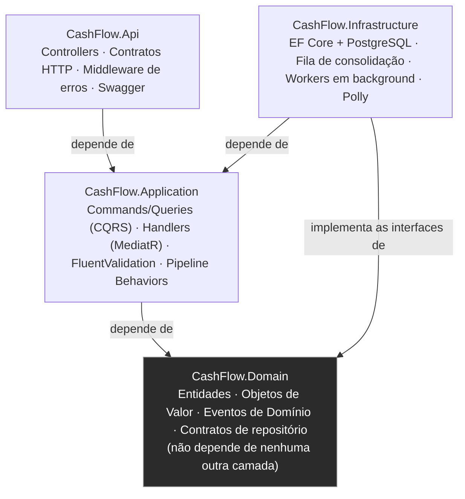
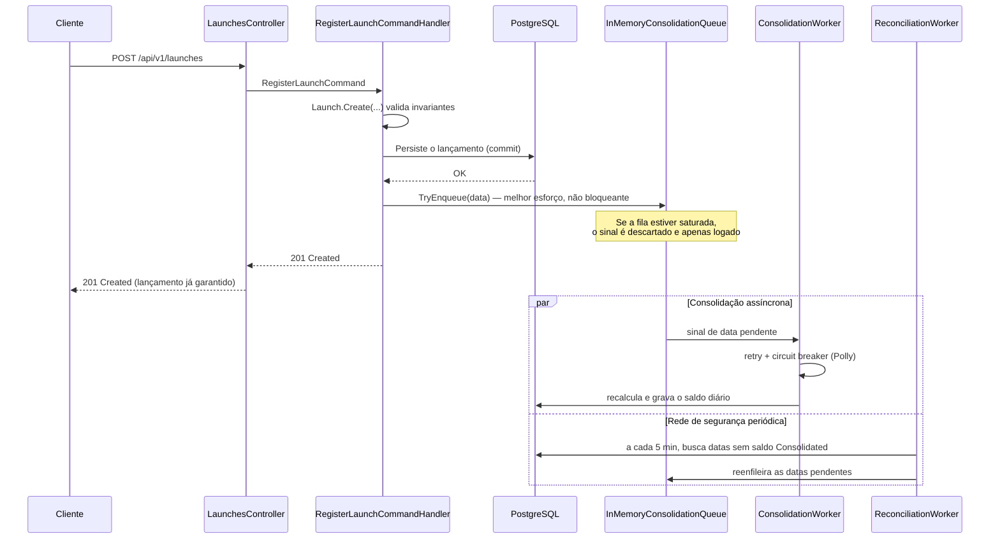
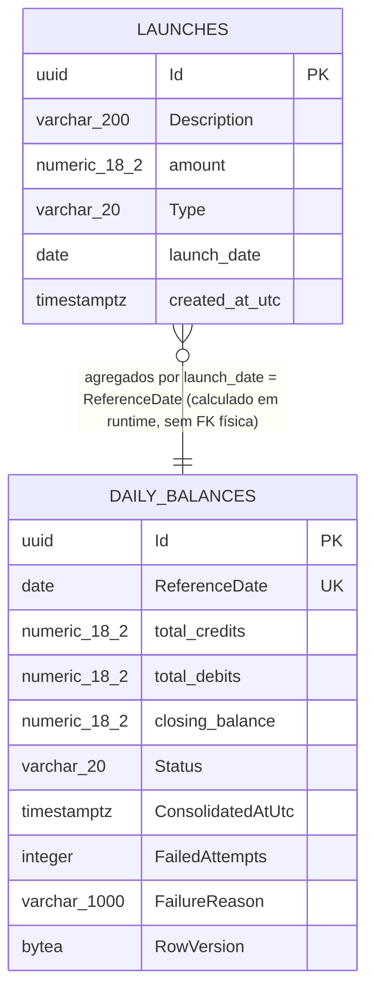

# CashFlow API

Este repositório é a minha solução para o desafio técnico de Desenvolvedor de Software. A proposta original é simples de descrever: um lojista precisa controlar o fluxo de caixa do dia a dia — registrando créditos e débitos — e quer um relatório com o saldo consolidado de cada dia. O desafio completo está no arquivo [`desafio-desenvolvedor-software.pdf`](./desafio-desenvolvedor-software.pdf), na raiz deste repositório.

Por trás dessa descrição simples, o próprio desafio já avisa qual é o ponto que realmente importa: o registro de lançamentos **não pode parar** por causa da consolidação, mesmo em picos de até 50 requisições por segundo, com tolerância de perda de apenas 5%. Foi esse requisito que guiou praticamente todas as decisões de arquitetura que tomei aqui, e vou explicar o porquê de cada uma ao longo deste documento.

Antes de entrar em código, um resumo rápido de como este README está organizado — ele foi escrito para ser lido de cima a baixo, mas também para servir de referência pontual caso você já saiba o que está procurando.

## Sumário

- [O que este projeto faz](#o-que-este-projeto-faz)
- [O que o desafio pedia e o que foi entregue](#o-que-o-desafio-pedia-e-o-que-foi-entregue)
- [Como rodar o projeto na sua máquina](#como-rodar-o-projeto-na-sua-máquina)
- [Como testar a API](#como-testar-a-api)
- [Como acessar a documentação Swagger](#como-acessar-a-documentação-swagger)
- [Como a aplicação foi organizada por dentro (arquitetura)](#como-a-aplicação-foi-organizada-por-dentro-arquitetura)
- [Padrões de projeto que usei, e por quê](#padrões-de-projeto-que-usei-e-por-quê)
- [Como o desafio de resiliência foi resolvido](#como-o-desafio-de-resiliência-foi-resolvido)
- [Como o banco de dados foi modelado](#como-o-banco-de-dados-foi-modelado)
- [Stack técnica usada](#stack-técnica-usada)
- [Estrutura de pastas](#estrutura-de-pastas)
- [Como os testes automatizados foram organizados](#como-os-testes-automatizados-foram-organizados)
- [Documentação de apoio (arquivos .txt)](#documentação-de-apoio-arquivos-txt)
- [O que eu faria a mais, com mais tempo](#o-que-eu-faria-a-mais-com-mais-tempo)

## O que este projeto faz

A aplicação resolve dois problemas de negócio, que são os dois pilares do desafio:

1. **Gestão de lançamentos financeiros** — permite registrar créditos e débitos e consultar os lançamentos de uma data.
2. **Saldo diário consolidado** — a partir dos lançamentos, calcula e disponibiliza o saldo (créditos, débitos e saldo final) de cada dia, seja para uma data específica ou para um intervalo de datas.

No domínio da aplicação, isso vira duas ideias centrais:

- **Lançamento (`Launch`)**: é a fonte da verdade. Um crédito ou débito, com valor, tipo, descrição e data. Uma vez criado, nunca é alterado nem apagado.
- **Saldo diário (`DailyBalance`)**: é uma **projeção derivada** dos lançamentos de uma data. Ele não guarda nenhuma informação que não possa ser recalculada a partir dos lançamentos — e essa característica (recalcular sempre do zero) é o que garante que a consolidação pode ser refeita quantas vezes for preciso, sem nunca gerar inconsistência.

## O que o desafio pedia e o que foi entregue

Fui bem literal aqui: peguei cada requisito do PDF do desafio e apontei exatamente onde, no código, ele está resolvido. A ideia é que você não precise confiar na minha palavra — pode ir direto no arquivo ou na rota citada.

**Requisitos de negócio**

| O que foi pedido | Como foi resolvido |
|---|---|
| Gestão dos lançamentos financeiros | `POST /api/v1/launches` para registrar, `GET /api/v1/launches?date=` para consultar |
| Relatório de saldo diário consolidado | `GET /api/v1/daily-balances/{date}` para uma data, `GET /api/v1/daily-balances?startDate=&endDate=` para um intervalo |

**Requisitos técnicos obrigatórios**

| O que foi pedido | Como foi resolvido |
|---|---|
| Aplicação em C# | .NET 8 / C# 12, do início ao fim |
| Rotinas de teste automatizadas | Testes de unidade (regras de negócio) e testes de integração (fluxo completo da API), detalhes mais abaixo |
| Boas práticas: Clean Code, SOLID, Design Patterns | Ver as duas seções seguintes deste README — expliquei cada padrão usado e onde ele está |
| README com pré-requisitos, passos para rodar e modo de funcionamento | Este arquivo que você está lendo agora |
| Código-fonte em repositório público no GitHub | Repositório já publicado como público |

**Requisitos opcionais** (o desafio deixa claro que são um diferencial, não obrigação — mas resolvi encarar todos os três)

| O que foi pedido | Como foi resolvido |
|---|---|
| Diagramas da arquitetura | Diagramas de camadas, de sequência e entidade-relacionamento, todos renderizados automaticamente pelo GitHub (Mermaid), nas seções [Arquitetura](#como-a-aplicação-foi-organizada-por-dentro-arquitetura) e [Banco de dados](#como-o-banco-de-dados-foi-modelado) |
| Processamento assíncrono, filas ou mensageria | Fila produtor/consumidor em memória, com um worker dedicado rodando em background — detalhes na seção de resiliência |
| Uso de containers (Docker) | `Dockerfile` + `docker-compose.yml`, sobe a API e o banco com um único comando |

**Requisitos não funcionais** — este é o coração do desafio, então tratei com mais cuidado

| O que foi pedido | Como foi resolvido |
|---|---|
| O registro de lançamentos não pode parar se a consolidação falhar | O registro é sempre síncrono e imediato; a consolidação roda por fora, de forma assíncrona, e uma falha nela nunca chega a afetar a resposta do registro |
| Suportar picos de 50 req/s com até 5% de perda tolerável | Fila interna com capacidade generosa, que nunca bloqueia o registro; retry com backoff e circuit breaker para falhas passageiras; e um job de reconciliação que garante que nenhuma data fica esquecida, mesmo se algum sinal for perdido |

Não deixei nenhum requisito pendente. O que fica de fora do escopo mínimo — e por que decidi deixar de fora — está descrito com transparência na última seção deste README, [O que eu faria a mais, com mais tempo](#o-que-eu-faria-a-mais-com-mais-tempo).

## Como rodar o projeto na sua máquina

Preparei duas formas de rodar, dependendo do que você tem disponível.

### Opção 1 — Docker Compose (a mais simples, recomendo essa)

Você só precisa ter o Docker e o Docker Compose instalados. Depois disso, um único comando na raiz do repositório:

```bash
docker compose up --build
```

Esse comando sobe dois serviços: o banco de dados PostgreSQL e a API. Você não precisa criar tabela nenhuma manualmente — a própria aplicação aplica as migrations do banco automaticamente ao iniciar. Depois de subir (leva alguns segundos na primeira vez, por conta do build):

- API: `http://localhost:8080`
- Swagger (documentação interativa): `http://localhost:8080/swagger`
- Health check: `http://localhost:8080/health`

### Opção 2 — Rodando localmente com o .NET SDK

Se preferir rodar direto na sua máquina (por exemplo, para debugar com o Visual Studio ou o Rider), você vai precisar do **.NET 8 SDK** instalado e de um PostgreSQL acessível. A forma mais fácil de ter esse PostgreSQL sem instalar nada extra é subir só o banco pelo Docker Compose:

```bash
docker compose up postgres
```

E então, em outro terminal, rodar a aplicação normalmente:

```bash
dotnet restore CashFlow.sln
dotnet build CashFlow.sln
dotnet run --project src/CashFlow.Api
```

A connection string padrão já aponta para `localhost:5432` (está em `src/CashFlow.Api/appsettings.json`); se o seu PostgreSQL estiver em outro lugar, ajuste esse arquivo ou defina a variável de ambiente `ConnectionStrings__CashFlowDatabase`. As migrations também são aplicadas automaticamente aqui — não precisa fazer nada manual no banco.

Por padrão, nesse modo a aplicação sobe em:

- API: `http://localhost:5080`
- Swagger: `http://localhost:5080/swagger`
- Health check: `http://localhost:5080/health`

## Como testar a API

Existem três jeitos de testar, do mais simples ao mais completo. Recomendo começar pelo Swagger — é o caminho mais rápido para "ver a aplicação funcionando" sem precisar instalar nada além do que já foi pedido para rodar o projeto.

**1. Pelo Swagger, direto no navegador (o jeito mais fácil)**

Depois de subir a aplicação (Docker ou local), acesse o endereço do Swagger indicado na seção acima. Lá você vai ver todos os endpoints organizados, com a descrição de cada um, o formato exato esperado no corpo da requisição, e os possíveis códigos de resposta. Clique em qualquer endpoint, depois em **"Try it out"**, preencha os campos e clique em **"Execute"** — a própria página faz a chamada HTTP para você e mostra a resposta, sem precisar de Postman, Insomnia ou linha de comando.

Um roteiro rápido de teste manual, direto pelo Swagger:

1. Abra `POST /api/v1/launches` e registre um crédito, por exemplo com `amount: 500` e `type: "Credit"`.
2. Registre também um débito, com `amount: 200` e `type: "Debit"`, na mesma data.
3. Abra `GET /api/v1/daily-balances/{date}` com a mesma data e confira o saldo — como a consolidação roda em background, pode levar um instante até o saldo aparecer como `Consolidated` (você pode acelerar isso chamando `POST /api/v1/daily-balances/{date}/consolidate`, que força a consolidação imediatamente).
4. Tente registrar um lançamento com valor negativo ou zero — a API deve responder `400 Bad Request` com a mensagem de validação, em vez de aceitar o dado inválido.

**2. Por linha de comando, com `curl`**

Se preferir a linha de comando, alguns exemplos prontos (ajuste a porta para `5080` se estiver rodando localmente em vez de Docker):

```bash
# Registrar um crédito
curl -X POST http://localhost:8080/api/v1/launches \
  -H "Content-Type: application/json" \
  -d '{"description":"Venda de produto","amount":500.00,"type":"Credit","launchDate":"2025-01-15"}'

# Registrar um débito
curl -X POST http://localhost:8080/api/v1/launches \
  -H "Content-Type: application/json" \
  -d '{"description":"Pagamento de fornecedor","amount":200.00,"type":"Debit","launchDate":"2025-01-15"}'

# Consultar os lançamentos do dia
curl "http://localhost:8080/api/v1/launches?date=2025-01-15"

# Forçar a consolidação imediata dessa data (sem esperar o worker em background)
curl -X POST http://localhost:8080/api/v1/daily-balances/2025-01-15/consolidate

# Consultar o saldo consolidado
curl http://localhost:8080/api/v1/daily-balances/2025-01-15
```

**3. Pelos testes automatizados (a forma mais confiável)**

Os testes automatizados já cobrem esses mesmos fluxos de ponta a ponta, então rodá-los é uma forma rápida de confirmar que tudo está funcionando como esperado, sem depender de testar manualmente endpoint por endpoint:

```bash
# Testes de unidade — rodam em segundos, não precisam de Docker nem banco
dotnet test tests/CashFlow.UnitTests/CashFlow.UnitTests.csproj

# Testes de integração — sobem a API real contra um PostgreSQL de verdade
# (o Testcontainers cria e destrói esse banco automaticamente; exige Docker rodando)
dotnet test tests/CashFlow.IntegrationTests/CashFlow.IntegrationTests.csproj
```

Expliquei com mais detalhe o que cada teste cobre na seção [Como os testes automatizados foram organizados](#como-os-testes-automatizados-foram-organizados) e no arquivo [`02-COMO-TESTAR-A-API.txt`](./02-COMO-TESTAR-A-API.txt), que traz também um roteiro para observar a resiliência da consolidação na prática (por exemplo, registrando vários lançamentos rapidamente e observando o worker processá-los em background).

## Como acessar a documentação Swagger

Toda a API é documentada automaticamente via **Swagger / OpenAPI**. Isso significa que não escrevi a documentação "à mão" em um lugar separado do código — ela é gerada a partir dos próprios comentários que coloquei em cada endpoint do controller, então a documentação nunca fica desatualizada em relação ao código real.

| Onde você está rodando | Endereço do Swagger UI |
|---|---|
| Docker Compose | `http://localhost:8080/swagger` |
| `dotnet run` local | `http://localhost:5080/swagger` |

Uma observação importante: o Swagger só fica disponível quando a aplicação roda em ambiente de `Development` (que é como o `docker-compose.yml` e a configuração local já vêm, por padrão, prontos para rodar). Isso não é uma limitação por falta de tempo — é uma prática comum de segurança: em um ambiente de produção real, você não quer expor uma página que permite disparar chamadas contra a API para qualquer pessoa que descubra a URL.

## Como a aplicação foi organizada por dentro (arquitetura)

Optei por organizar o projeto em camadas, seguindo os princípios da **Clean Architecture**, com conceitos de **DDD** (entidades, objetos de valor, eventos de domínio) na camada de domínio, e **CQRS** (separando comandos de escrita e consultas de leitura) através do MediatR na camada de aplicação.

A ideia central por trás dessa escolha é simples de justificar: a regra de negócio (o que é um lançamento válido, como se calcula um saldo) não deveria depender de detalhes técnicos como "qual banco de dados eu uso" ou "qual framework web recebe a requisição". Se um dia eu precisar trocar o PostgreSQL por outro banco, ou adicionar uma segunda forma de entrada além da API REST, a regra de negócio no `Domain` não muda uma linha.

```
┌─────────────────────────────────────────────────────────────┐
│                        CashFlow.Api                          │
│   Controllers · Contratos HTTP · Middleware de erros ·       │
│   Configuração do Swagger                                    │
└───────────────────────────┬───────────────────────────────────┘
                            │ depende de
┌───────────────────────────▼───────────────────────────────────┐
│                    CashFlow.Application                       │
│   Commands/Queries (CQRS) · Handlers (MediatR) · Validações    │
│   (FluentValidation) · Behaviors de pipeline · Interfaces       │
└───────────────────────────┬───────────────────────────────────┘
                            │ depende de
┌───────────────────────────▼───────────────────────────────────┐
│                       CashFlow.Domain                          │
│   Entidades · Objetos de Valor · Eventos de Domínio ·           │
│   Exceções de negócio · Contratos de repositório                │
│             (não depende de nenhuma outra camada)               │
└───────────────────────────▲─────────────���─────────────────────┘
                            │ implementa as interfaces de
┌───────────────────────────┴───��───────────────────────────────┐
│                    CashFlow.Infrastructure                     │
│   EF Core + PostgreSQL · Fila de consolidação em memória ·      │
│   Workers em background · Políticas de resiliência (Polly)      │
└─────────────────────────────────────────────────────────────────┘
```

O mesmo desenho, como diagrama renderizado automaticamente pelo GitHub:



### O que acontece, passo a passo, quando você registra um lançamento

Achei mais didático contar essa parte como uma história, porque é exatamente aqui que o requisito de resiliência do desafio é resolvido:

1. A requisição `POST /api/v1/launches` chega ao `LaunchesController`. O controller não tem regra de negócio nenhuma — ele só traduz a requisição HTTP em um comando (`RegisterLaunchCommand`) e entrega para o MediatR.
2. Antes do comando chegar no handler que de fato faz o trabalho, ele passa por dois "behaviors" configurados no pipeline: um valida os dados (`ValidationBehavior`, usando as regras do FluentValidation) e outro registra logs (`LoggingBehavior`). Se a validação falhar, o fluxo para aqui mesmo, e o handler nem chega a ser chamado.
3. O `RegisterLaunchCommandHandler` cria o lançamento através do método `Launch.Create(...)`. É esse método — e não o handler — que garante que um lançamento nunca existe em estado inválido (valor negativo, tipo desconhecido, etc.). O lançamento é então salvo no banco de dados de forma síncrona, e essa transação é confirmada (commit).
4. **Só depois** de o lançamento já estar salvo com segurança no banco, o handler tenta avisar que aquela data precisa ser (re)consolidada, colocando um sinal em uma fila interna. Esse aviso é "melhor esforço": se a fila estiver momentaneamente cheia, o sinal é descartado e apenas registrado em log — mas o lançamento em si **já foi salvo no passo anterior** e nunca é perdido.
5. Em paralelo, um worker dedicado (`ConsolidationWorker`) fica consumindo essa fila e recalculando o saldo da data sinalizada, com políticas de nova tentativa (retry) e circuit breaker para lidar com falhas passageiras.
6. Por segurança, existe ainda um segundo worker (`ReconciliationWorker`) que roda periodicamente e verifica se existe alguma data com lançamentos mas sem saldo consolidado — cobrindo tanto os sinais que eventualmente foram descartados quanto falhas que esgotaram todas as tentativas de retry.

O detalhe que faz esse desenho funcionar com segurança é que a consolidação é **idempotente**: ela sempre recalcula o saldo do zero, a partir dos lançamentos reais daquela data. Isso significa que não importa quantas vezes ela seja reprocessada — pelo worker, pela reconciliação, ou manualmente pelo endpoint de consolidação forçada — o resultado final é sempre o mesmo, sem risco de duplicar valores.

O mesmo fluxo, como diagrama de sequência. Vale reparar que o `201 Created` volta para o cliente **antes** de qualquer tentativa de consolidação — é exatamente esse detalhe que garante que uma falha na consolidação nunca derruba o registro do lançamento:



## Padrões de projeto que usei, e por quê

Não usei padrão de projeto "porque sim" — cada um resolve um problema concreto que apareceu ao construir a solução. Aqui vai um resumo de cada um; a explicação completa, com trechos de código e os trade-offs que considerei, está no arquivo [`04-PADROES-DE-PROJETO-EXPLICADOS.txt`](./04-PADROES-DE-PROJETO-EXPLICADOS.txt).

| Padrão | Onde está no código | Por que usei |
|---|---|---|
| Clean Architecture | Divisão em `Domain` / `Application` / `Infrastructure` / `Api` | Para a regra de negócio não depender de detalhes técnicos, e para poder trocar banco, framework ou até criar novos módulos sem tocar em código já validado |
| CQRS | `Commands` e `Queries`, na camada `Application` | Separar claramente "o que muda dado" de "o que só lê dado", cada um com seu próprio modelo |
| Mediator | MediatR (`ISender`) | Para os controllers não precisarem conhecer os handlers diretamente; um novo caso de uso só cria seu próprio Command/Query, sem alterar o que já existe |
| Decorator (behaviors de pipeline) | `ValidationBehavior`, `LoggingBehavior` | Para validar e logar de forma automática em todos os comandos e consultas, em vez de repetir esse código em cada handler |
| Repository | `ILaunchRepository`, `IDailyBalanceRepository` | Para o Domain "pedir" persistência sem saber como ela é feita — quem implementa de fato é a Infrastructure |
| Unit of Work | `IUnitOfWork` | Para controlar quando a transação é confirmada, sem expor o `DbContext` do Entity Framework para as camadas de dentro |
| Aggregate Root / Entity | `Launch`, `DailyBalance` | Para que só exista um jeito de criar ou alterar um lançamento, e esse jeito sempre valide as regras de negócio |
| Value Object | `Money` | Para tornar impossível existir um valor monetário inválido (negativo ou zero) em qualquer ponto do sistema |
| Domain Events | `LaunchRegisteredEvent` | Para o lançamento apenas "anunciar" que foi criado, sem precisar saber quem (ou o quê) vai reagir a isso |
| Factory Method | `Launch.Create(...)`, `Money.Create(...)` | Para garantir que toda validação acontece em um único lugar, na hora da criação do objeto |
| Producer/Consumer | Fila de consolidação + `ConsolidationWorker` | Para separar completamente "quem registra o lançamento" de "quem atualiza o saldo" — é essa separação que resolve o requisito de resiliência |
| Retry + Circuit Breaker | Políticas do Polly na consolidação | Para absorver falhas passageiras (por exemplo, uma instabilidade momentânea do banco) sem insistir sem parar em algo que já está com problema |
| Injeção de Dependência / Inversão de Dependência | Em toda a aplicação | Para as camadas de dentro dependerem só de interfaces, nunca de uma implementação concreta específica |

## Como o desafio de resiliência foi resolvido

Esse é, sem dúvida, o requisito que exigiu mais reflexão — e também o que mais gosto de explicar, porque a solução não depende de nenhuma peça de infraestrutura externa complexa, só de organizar bem o fluxo.

O requisito, reescrito com minhas palavras: **o sistema de consolidação pode falhar, ficar lento, ou receber um pico de carga — e nada disso pode impedir que um lançamento seja registrado.** E, em picos de até 50 requisições por segundo, é aceitável perder até 5% dos sinais de consolidação (não dos lançamentos — dos *sinais que disparam a consolidação*), desde que isso não gere inconsistência.

A solução tem cinco peças que trabalham juntas:

1. **O registro e a consolidação são coisas completamente separadas.** O lançamento é salvo de forma síncrona, sempre. A consolidação nunca acontece dentro da mesma requisição — ela é sempre assíncrona, em background.
2. **A fila que liga as duas coisas nunca trava o registro.** Usei uma fila em memória (`System.Threading.Channels`) com capacidade limitada. Se ela estiver momentaneamente saturada — no tal pico de 50 req/s —, o sinal mais recente é simplesmente descartado (e logado), em vez de fazer a requisição de registro esperar. Isso é o que garante que a "perda tolerável de 5%" nunca signifique perder um lançamento: o dado financeiro já foi salvo antes desse ponto, o que se perde é só o "aviso" de que aquela data precisa ser recalculada.
3. **Retry com backoff exponencial e circuit breaker (via Polly)** no worker que consome a fila, para absorver problemas passageiros (por exemplo, o banco ficar indisponível por alguns segundos) sem ficar insistindo agressivamente contra uma dependência que já está com problema.
4. **Um job de reconciliação, que roda periodicamente**, e serve como rede de segurança final: ele procura qualquer data que tenha lançamentos mas ainda não tenha um saldo consolidado, e manda um novo sinal para ela. Isso cobre exatamente os casos em que um sinal foi descartado no passo 2, ou em que todas as tentativas de retry do passo 3 se esgotaram.
5. **A consolidação é idempotente** — ela sempre recalcula o saldo do zero, a partir dos lançamentos reais daquela data. Isso é o que torna seguro reprocessar a mesma data quantas vezes for preciso, sem nunca duplicar ou distorcer o saldo.

Uma decisão que quero deixar bem transparente: escolhi uma fila **em memória**, e não um broker de mensageria externo (RabbitMQ, Amazon SQS, etc.). Fiz essa escolha porque, para uma única instância da aplicação — que é o escopo real deste desafio —, um broker externo adicionaria complexidade de infraestrutura sem resolver nada que a fila em memória já não resolvesse. Ao mesmo tempo, não fechei essa porta: toda a interação com a fila passa pela interface `IConsolidationQueue`, então trocar essa implementação por um broker real, se a aplicação um dia precisar rodar em múltiplas instâncias, é uma mudança isolada na camada de Infraestrutura — nem o Domain nem a Application precisariam mudar uma linha.

## Como o banco de dados foi modelado

O banco é **PostgreSQL**, e todo o schema é criado e versionado por **migrations do Entity Framework Core** — não existe nenhum script SQL manual para rodar. A própria aplicação aplica as migrations automaticamente na inicialização, então subir o projeto (por Docker ou localmente) já deixa o banco pronto para uso.

Existem só duas tabelas, uma para cada conceito do domínio:

```
┌───────────────────────────────────┐        ┌────────────────────────────────────────┐
│              launches             │        │            daily_balances              │
├───────────────────────────────────┤        ├────────────────────────────────────────┤
│ Id                uuid       (PK) │        │ Id                  uuid          (PK) │
│ Description       varchar(200)    │        │ ReferenceDate       date       (UQ)*   │
│ amount             numeric(18,2)  │        │ total_credits       numeric(18,2)      │
│ Type               varchar(20)    │        │ total_debits        numeric(18,2)      │
│ launch_date        date      (IX) │◄──┐    │ closing_balance     numeric(18,2)      │
│ created_at_utc     timestamptz    │   │    │ Status              varchar(20)        │
└───────────────────────────────────┘   │    │ ConsolidatedAtUtc   timestamptz (null) │
                                        │    │ FailedAttempts      integer            │
                    agregados por data  └────┤ FailureReason       varchar(1000) null │
                    (sem FK física —          │ RowVersion          bytea (concorrência)│
                    relação é lógica,          └────────────────────────────────────────┘
                    calculada em runtime)

  (PK) = chave primária   (UQ) = índice único   (IX) = índice não único
  * ux_daily_balances_reference_date garante uma única linha por data
```

O mesmo modelo, como diagrama entidade-relacionamento (renderizado automaticamente pelo GitHub):



**Tabela `launches`** — a fonte única da verdade. Uma vez criado um lançamento, ele nunca é alterado nem apagado (é uma tabela só de inserção, o que também simplifica bastante a auditoria).

| Coluna | Tipo | Aceita nulo? | O que guarda |
|---|---|---|---|
| `Id` | `uuid` | não | Identificador do lançamento (chave primária) |
| `Description` | `varchar(200)` | não | Descrição do lançamento |
| `amount` | `numeric(18,2)` | não | Valor monetário, sempre estritamente positivo — essa regra é garantida pelo Value Object `Money`, então nem chega a existir a possibilidade de salvar um valor inválido |
| `Type` | `varchar(20)` | não | `Credit` (entrada) ou `Debit` (saída), gravado por nome, não por número, para o dado no banco ser legível por si só |
| `launch_date` | `date` | não | Data do lançamento. Tem um índice (`ix_launches_launch_date`) porque é o campo mais usado para consultar e para consolidar |
| `created_at_utc` | `timestamp with time zone` | não | Quando o registro foi criado no sistema (em UTC) |

**Tabela `daily_balances`** — uma projeção derivada. Ela nunca é "incrementada" a cada novo lançamento; é sempre recalculada por completo, do zero, quando a consolidação roda.

| Coluna | Tipo | Aceita nulo? | O que guarda |
|---|---|---|---|
| `Id` | `uuid` | não | Identificador do saldo diário (chave primária) |
| `ReferenceDate` | `date` | não | Data a que o saldo se refere. Tem um índice único (`ux_daily_balances_reference_date`) — é o próprio banco que garante que nunca vai existir mais de uma linha para a mesma data, mesmo se dois processos tentarem consolidar a mesma data ao mesmo tempo |
| `total_credits` | `numeric(18,2)` | não | Soma de todos os créditos daquela data |
| `total_debits` | `numeric(18,2)` | não | Soma de todos os débitos daquela data |
| `closing_balance` | `numeric(18,2)` | não | `total_credits - total_debits`. Pode ser negativo |
| `Status` | `varchar(20)` | não | `Pending`, `Consolidated` ou `Failed` — o ciclo de vida da consolidação daquela data |
| `ConsolidatedAtUtc` | `timestamp with time zone` | sim | Quando a última consolidação bem-sucedida aconteceu |
| `FailedAttempts` | `integer` | não | Quantas tentativas de consolidação falharam seguidas |
| `FailureReason` | `varchar(1000)` | sim | O motivo da última falha, quando `Status = Failed` |
| `RowVersion` | `bytea` | sim | Token de concorrência otimista. Evita que duas consolidações concorrentes para a mesma data se sobrescrevam silenciosamente uma à outra sob carga alta |

Um detalhe que vale explicar: **não existe uma foreign key física** ligando as duas tabelas. A relação entre elas é lógica — feita por data (`launch_date` de um lado, `ReferenceDate` do outro) — e calculada em tempo de execução, na hora da consolidação. Isso é intencional: `daily_balances` não é uma entidade com vida própria, é uma projeção, então não faz sentido tratá-la como se tivesse uma relação estrutural fixa com `launches`.

## Stack técnica usada

| Camada / Preocupação | Tecnologia escolhida |
|---|---|
| Linguagem / Runtime | C# 12 / .NET 8 |
| Framework Web | ASP.NET Core Web API |
| Mediador (CQRS) | MediatR |
| Validação de entrada | FluentValidation |
| ORM | Entity Framework Core 8 |
| Banco de dados | PostgreSQL 16 (via Npgsql) |
| Resiliência | Polly (retry + circuit breaker) |
| Fila / mensageria | `System.Threading.Channels` (fila em memória, produtor/consumidor) |
| Documentação da API | Swagger / OpenAPI (Swashbuckle) |
| Testes de unidade | xUnit, FluentAssertions, Moq |
| Testes de integração | xUnit, WebApplicationFactory, Testcontainers (PostgreSQL real, em container) |
| Containerização | Docker / Docker Compose |

## Estrutura de pastas

```
src/
  CashFlow.Api/              → Camada de apresentação (Controllers, Program.cs, Middleware)
  CashFlow.Application/      → Casos de uso (Commands, Queries, Handlers, Validators, DTOs)
  CashFlow.Domain/           → Entidades, Value Objects, Eventos e regras de negócio puras
  CashFlow.Infrastructure/   → Persistência (EF Core/PostgreSQL), fila em memória, workers, Polly
tests/
  CashFlow.UnitTests/        → Testes de unidade (Domain, Application, Infrastructure isolada)
  CashFlow.IntegrationTests/ → Testes de integração ponta a ponta (API + PostgreSQL real via Testcontainers)
desafio-desenvolvedor-software.pdf   → O desafio original, para referência
ARQUITETURA-E-DECISOES-TECNICAS.txt  → Racional detalhado de cada decisão técnica
01 a 07 (*.txt)                      → Documentação de apoio, ver seção abaixo
Dockerfile
docker-compose.yml
CashFlow.sln
```

## Como os testes automatizados foram organizados

Separei os testes em duas suítes, porque elas verificam coisas diferentes e têm custos diferentes para rodar:

- **`CashFlow.UnitTests`** — testa a lógica de negócio isoladamente: as regras de `Launch` e `Money` (por exemplo, "não é possível criar um lançamento com valor negativo"), os validadores do FluentValidation, os handlers da camada de aplicação (usando mocks no lugar do banco de dados real, com Moq) e o comportamento da fila de consolidação, incluindo o cenário de saturação/descarte que resolve o requisito de resiliência. Essa suíte roda em segundos, em qualquer máquina, sem precisar de Docker nem de banco de dados.
- **`CashFlow.IntegrationTests`** — testa a aplicação de verdade, de ponta a ponta: sobe a API real (via `WebApplicationFactory`) contra um PostgreSQL real e descartável, criado automaticamente pelo Testcontainers a cada execução. Cobre o fluxo completo dos endpoints — registrar um lançamento, consultar por data, forçar a consolidação, consultar por intervalo, e confirmar que consolidar a mesma data duas vezes não gera inconsistência (idempotência).

```bash
# Suíte de unidade
dotnet test tests/CashFlow.UnitTests/CashFlow.UnitTests.csproj

# Suíte de integração (exige Docker em execução)
dotnet test tests/CashFlow.IntegrationTests/CashFlow.IntegrationTests.csproj

# As duas de uma vez
dotnet test CashFlow.sln
```

## Documentação de apoio (arquivos .txt)

Além deste README, deixei uma série de arquivos `.txt` na raiz do repositório. A ideia deles é bem prática: são respostas escritas, em português, para as perguntas mais comuns que costumam surgir em uma conversa técnica sobre um projeto assim — "por que você escolheu esse padrão?", "como você testaria isso?", "como está modelado o banco?". Cada um foca em um assunto, para ser fácil de consultar rapidamente.

| Arquivo | O que você encontra nele |
|---|---|
| [`01-ANALISE-DE-ADERENCIA-AO-DESAFIO.txt`](./01-ANALISE-DE-ADERENCIA-AO-DESAFIO.txt) | O checklist completo, requisito por requisito do PDF, comparado com o que foi implementado |
| [`02-COMO-TESTAR-A-API.txt`](./02-COMO-TESTAR-A-API.txt) | Um passo a passo mais detalhado para testar cada endpoint (Swagger e `curl`), com cenários de erro e um roteiro para observar a resiliência funcionando na prática |
| [`03-ARQUITETURA-EXPLICADA.txt`](./03-ARQUITETURA-EXPLICADA.txt) | As quatro camadas explicadas em formato de pergunta e resposta, do jeito que eu explicaria numa entrevista |
| [`04-PADROES-DE-PROJETO-EXPLICADOS.txt`](./04-PADROES-DE-PROJETO-EXPLICADOS.txt) | Cada padrão de projeto, um por um: o que é, onde está no código, e por que fez sentido usar aqui |
| [`05-BANCO-DE-DADOS-EXPLICADO.txt`](./05-BANCO-DE-DADOS-EXPLICADO.txt) | A modelagem do banco explicada com mais profundidade, incluindo o porquê de cada decisão |
| [`06-TESTES-EXPLICADOS.txt`](./06-TESTES-EXPLICADOS.txt) | As duas suítes de teste detalhadas, o que cada arquivo de teste cobre e como rodá-las |
| [`07-QUALIDADE-SOLID-TESTABILIDADE-DESACOPLAMENTO.txt`](./07-QUALIDADE-SOLID-TESTABILIDADE-DESACOPLAMENTO.txt) | Como os quatro critérios de avaliação do desafio (qualidade de código, testabilidade, desacoplamento e documentação) aparecem, de forma concreta, no código |
| [`ARQUITETURA-E-DECISOES-TECNICAS.txt`](./ARQUITETURA-E-DECISOES-TECNICAS.txt) | O documento mais longo e narrativo, com o racional completo de cada decisão técnica e os trade-offs que considerei antes de escolher cada caminho |

## O que eu faria a mais, com mais tempo

O próprio desafio pede para eu ser transparente sobre isso, e eu concordo que é importante: um projeto de desafio técnico tem um tempo limitado, e é mais honesto explicar o que ficou fora do escopo (e por quê) do que fingir que o projeto está "100% pronto para produção" sem ressalva nenhuma. Essas são as coisas que eu evoluiria numa versão real deste sistema:

- **Trocar a fila em memória por um broker de mensageria real** (RabbitMQ, Azure Service Bus ou Amazon SQS), no momento em que a aplicação precisasse escalar para múltiplas instâncias rodando ao mesmo tempo. Como expliquei na seção de resiliência, já deixei essa porta aberta através da interface `IConsolidationQueue` — trocar a implementação não exigiria mudar a Application nem o Domain.
- **Autenticação e autorização** (por exemplo, JWT) nos endpoints. Hoje eles estão deliberadamente abertos porque isso não fazia parte do escopo descrito no desafio, mas em qualquer sistema real isso seria obrigatório.
- **Paginação** no endpoint que lista lançamentos por data, pensando em um comércio com um volume de lançamentos muito alto em um único dia.
- **Observabilidade mais completa** — hoje eu só tenho visibilidade da fila de consolidação e do circuit breaker através dos logs. Adicionar métricas (por exemplo, com OpenTelemetry) sobre a profundidade da fila, a taxa de sinais descartados e o estado do circuit breaker daria uma visão bem mais confiável em produção.
- **Suporte a múltiplas moedas**, se o negócio um dia precisasse operar em mais de um país.
- **Versionamento de API mais explícito** — a rota já usa o prefixo `v1` pensando nisso, mas hoje existe só uma versão; formalizar essa estratégia ajudaria a evoluir o contrato sem quebrar clientes existentes no futuro.
- **Novos módulos de negócio** (por exemplo, contas a pagar/receber, conciliação bancária), aproveitando a mesma Clean Architecture já montada — cada módulo novo entraria com seus próprios Commands/Queries/Handlers, sem precisar alterar o que já existe e já está testado.
